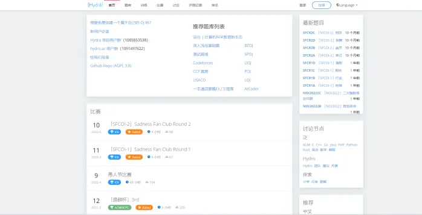

# 艾伦OJ判题平台

## 项目介绍
用户可以选择题目，在线做题，编写代码并且提交代码；系统会对用户提交的代码，根据我们出题人设置的答案，来判断用户的提交结果是否正确。

ACM（程序设计竞赛），也是需要依赖判题系统来检测参赛者的答案是否合理。

## 技术栈
### 前端
Vue3、Arco Design 组件库、手撸项目模板、在线代码编辑器、在线文档浏览
### 后端
Java 进程控制、Java 安全管理器、部分 JVM 知识点
虚拟机（云服务器）、Docker（代码沙箱实现）
Spring Cloud 微服务、消息队列、多种设计模式